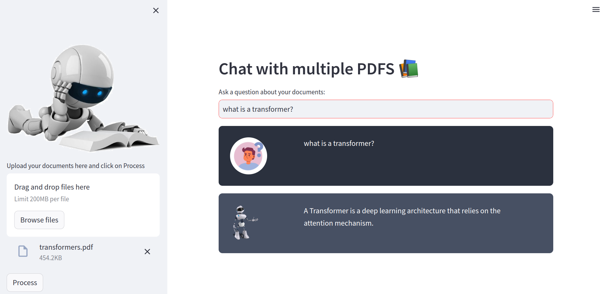

# Chat Documents

This is a repository for the Chat Documents application. The application allows users to chat with multiple PDF documents using conversational AI. The application is built using Streamlit and relies on various libraries and modules.




## Installation

To run the Chat Documents application, follow these steps:

1. Clone the repository:

```
git clone https://github.com/your-username/your-repository.git
```

2. Install the required dependencies. You can use pip to install them:

```
pip install -r requirements.txt
```

3. Set up the environment variables. The application uses the `dotenv` library to load environment variables. Create a `.env` file in the project directory and add the necessary variables.

4. Run the application:

```
streamlit run app.py
```

## Usage

Once the application is running, you can access it through your web browser. The main page displays a chat interface where you can ask questions about your documents.

### Uploading PDF Documents

On the sidebar, you'll find an option to upload PDF documents. Click on the "Upload your documents here and click on Process" button and select one or more PDF files. Once the files are uploaded, click the "Process" button.

### Chatting with the Documents

After uploading and processing the PDF documents, you can ask questions by typing them in the text input field. Press Enter or click the "Ask" button to submit your question.

The application will use conversational AI to provide responses based on the content of the uploaded documents. The responses will be displayed in the chat interface.

### Chat History

The application maintains a chat history, showing both user questions and bot responses. The chat history is displayed in a structured format, with user messages in bold and bot responses in italics.

## Components and Libraries

The Chat Documents application uses several components and libraries:

- **Streamlit**: A Python library for building web applications with interactive elements.
- **langchain**: A custom library for natural language processing tasks, including conversational retrieval, text splitting, embeddings, vector stores, chat models, and memory.
- **dotenv**: A library for loading environment variables from a `.env` file.
- **PyPDF2**: A library for extracting text from PDF documents.
- **htmlTemplates**: Custom HTML templates for formatting the chat interface.
- **HuggingFace Transformers**: A library for natural language processing using pre-trained models from Hugging Face's model hub.

## Contributors

- [Dor Getter]
